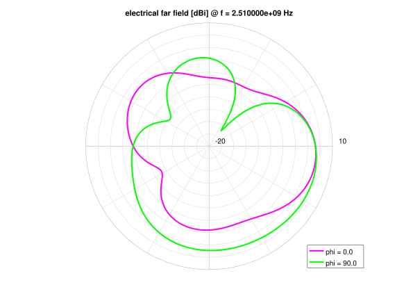
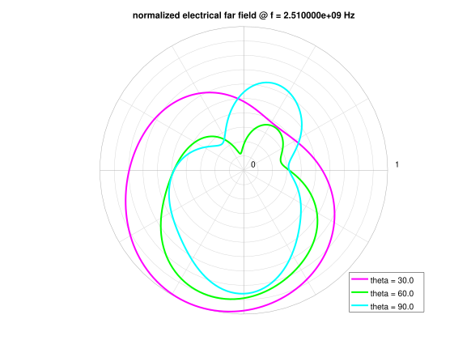

[](https://liberapay.com/thomaslepoix/donate)
[](https://discord.gg/P82fEmE)
[](LICENSE)
[](https://github.com/Open-RFlab/octave-openems-hll/releases/latest)

[](https://build.opensuse.org/package/show/home:thomaslepoix:open-rflab/octave-openems-hll)
[](https://github.com/Open-RFlab/octave-openems-hll/releases/latest)
# OpenEMS High-level layer

## Description

This is a set of Octave functions to ease the use of the [openEMS](https://openems.de) FDTD simulator.

Focus is on user interface and post-processing functions.

## Features

### Outputs

- Touchstone file
- S parameters (Smith chart and orthogonal)

 

- Feed point impedance


- Feed point VSWR


- Phase response (wrapped and unwrapped)

 

- Phase delay and group delay

 

- Azimuth & elevation far field radiation pattern (polar and orthogonal, normalized and in dBi)

 
 
 

- 3D far field radiation pattern for multiple frequencies (animated `.gif`)


- Electric & magnetic fields, current and current density in time domain (visible with Paraview)


### Command Line Interface

Here is an example of a script help produced by the `oemshll_cli()` function. This CLI aims to be exhaustive and wrap most common use cases.

```
Usage:  ./script.m <options>
        octave script.m <option>

General options:
	-h, --help             Display this help and exit.
	-c, --clean            Remove all result and simulation files.
	-cr, --clean-result    Remove all result files.
	-cs, --clean-sim       Remove all simulation files.
	--port <N>             Enable a port. 'N' is a port number. By default the port 1 is enabled.
	--no-port <N>          Disable a port. 'N' is a port number. By default all other ports are disabled.
	                       Possible port numbers are : 1  2

Control options:
	--only-preprocess      Only structure and mesh construction.
	--only-postprocess     Only process simulation datas to produce graphics and far field calculation.
	--no-preprocess        Do not execute anything before siulation.
	--no-postprocess       Do not execute anything after simulation.
	--no-gui               Do not open AppCSXCAD.

Preprocessing options:
	--dump-et              Dump E field in time domain.
	--dump-ht              Dump H field in time domain.
	--dump-jt              Dump current in time domain.
	--dump-cdt             Dump current density in time domain.
	--no-conductingsheet   Use 3D perfect metal boxes instead of 2D conducting sheets.
	--no-highresmesh       No high resolution mesh for non orthogonal shapes.
	--no-metalresmesh      No particular mesh lines (thirds rule) at metal resolution for orthogonal shapes.
	--keep-portlines       Effect only with '--no-metalresmesh', keep ports mesh lines.
	--no-smoothmesh        Only particular mesh lines.
	--no-mesh              Do not mesh any shape.
	--mur                  Use MUR boundary condition instead of PML_8. Results and simulation time may significantly vary.

Postprocessing options:
	--legend-out           Put legend boxes outside graphics
	--f <F>                Set frequency to place markers and compute far field radiations.
	                       Can be called multiple times. Example : '--f 3.1e09'
	--f-max s<A><B>        Place markers and compute far field radiations at the frequency for which the specified
	                       S parameter is maximal. A and B are port numbers, B must be active. Can be called multiple times.
	--f-min s<A><B>        Place markers and compute far field radiations at the frequency for which the specified
	                       S parameter is minimal. A and B are port numbers, B must be active. Can be called multiple times.
	--f-equal s<A><B> <F>  Place markers and compute far field radiations at the frequency for which the specified
	                       S parameter is equal to the specified value (in dB). Can be called multiple times.
	                       Example : '--f-equal s21 -3.5'.
	--dump-ff3d            Dump 3D far field radiation pattern.
	--nf2ff                Calcul far field radiation.
	--nf2ff-force          Force NF2FF calculation.
	--nf2ff-3d             Enable 3D far field representation (may be long).
	--nf2ff-frames <I>     Number of 3D frames to merge in a .gif. ImageMagick is required. Default (0, 1 or nothing) : use
	                       default or --f* args specified frequencies and no .gif generated.
	--nf2ff-delay          Delay between each frames (in ms). Cf. convert's '-delay' argument. Default : 30
	--nf2ff-phistep <I>    Set phi angle (elevation) step for 3D far field. I is in degree, default is 5.
	--nf2ff-thetastep <I>  Set theta angle (azimuth) step for 3D far field. I is in degree, default is 5.
	--nf2ff-anglestep <I>  Set phi & theta angle steps for 3D far field. I is in degree.
```

Here is the default returned object the user will have to deal with to structure its script.

```matlab
%%%% COMMAND LINE OBJECT
cli.name = name;
cli.path_result = [name, '_result'];
cli.path_simulation = [name, '_simulation'];
cli.clean = false;
cli.clean_result = false;
cli.clean_simulation = false;
cli.gui = true;
cli.process = true;
cli.preprocess = true;
cli.postprocess = true;
cli.legend_out = false;
cli.conductingsheet = true;
cli.f = [];
cli.f_max = num2str([]);
cli.f_min = num2str([]);
cli.f_equal_s = num2str([]);
cli.f_equal_v = [];
cli.nf2ff = false;
cli.nf2ff_mode = 0;
cli.nf2ff_3d = false;
cli.nf2ff_frames = 0;
cli.nf2ff_delay = '30';
cli.nf2ff_phistep = 5;
cli.nf2ff_thetastep = 5;
cli.dump_et = false;
cli.dump_ht = false;
cli.dump_jt = false;
cli.dump_cdt = false;
cli.dump_ff3d = false;
cli.mur = false;
cli.mesh = true;
cli.highresmesh = true;
cli.metalresmesh = true;
cli.keep_portlines = false;
cli.smoothmesh = true;
cli.active_ports = ports_index(1);
cli.ports_index = ports_index;
```

### Post-processing

The `oemshll_postProcess()` is a unique entry point to the whole simulation post-processing that also aims to be exaustive and suitable for most RF simulations.

Alternatively, one may want to use isolated post-processing functions from the following list:
- `oemshll_plotVSWR()`
- `oemshll_plotFeedImpedance()`
- `oemshll_plotSParameters()`
- `oemshll_plotSmithChart()`
- `oemshll_plotPhaseResponse()`
- `oemshll_plotPhaseDelay()`
- `oemshll_plotGroupDelay()`
- `plotFF3D_frames()`

Note that `oemshll_postProcess()` also uses post-processing functions that are already part of openEMS, such as `write_touchstone()`, `polarFF()`, `plotFFdB()` or `DumpFF2VTK()`.

## Installation

### Dependencies

- [OpenEMS](https://openems.de/index.php/OpenEMS#Installation) (`octave-openems` package available on Debian 10 based distros, `octave-openEMS` on openSUSE)
- [ImageMagick](https://imagemagick.org/script/download.php) (packages available on most distros)

### Package installation

- For Debian based distributions, a repository is available :

```sh
curl -s https://bintray.com/user/downloadSubjectPublicKey?username=bintray | sudo apt-key --keyring /etc/apt/trusted.gpg.d/open-rflab.gpg add -
echo "deb https://dl.bintray.com/open-rflab/debian $(lsb_release -cs) main" | sudo tee /etc/apt/sources.list.d/open-rflab.list

sudo apt-get update
sudo apt-get install octave-openems-hll                            # Use Debian 10 octave-openems package
sudo apt-get install octave-openems-hll --no-install-recommends    # Use manually installed openEMS
```

- For other systems, you can download Octave package [here](https://github.com/Open-RFlab/octave-openems-hll/releases) and install it this way :

```sh
sudo octave --eval 'pkg install -global openems-hll-*.tar.gz'
```

### Installation from sources

- Debian way :

```sh
octave-openems-hll $

    # Install building tools
    sudo apt-get install octave debhelper dh-octave devscripts equivs fakeroot
    # Install build-time dependencies
    sudo mk-build-deps --install --tool='apt-get --no-install-recommends --yes' debian/control
    # Generate package
    fakeroot debian/rules binary
    # Install package
    sudo apt-get install [--no-install-recommends] ../octave-openems-hll_*.deb
```

- Octave way :

```sh
octave-openems-hll $

    make dist
    sudo octave --eval 'pkg install -global target/openems-hll-*.tar.gz'
```

## Usage

- API of each function is described in the function files. 
- `oemshll_postProcess()` is an usage example of every other post-processing function.
- For a complete script example, and particularly usage of `oemshll_cli()` and `oemshll_postProcess()`, take a look to a script produced by [Qucs-RFlayout](https://github.com/thomaslepoix/Qucs-RFlayout).

## Contribution

This library is quite new and emerged from [Qucs-RFlayout](https://github.com/thomaslepoix/Qucs-RFlayout) and thus is oriented to fit its workflow and its use case. There are chances for that used in an other context, some things lack or seem oddly designed.

If you want to contribute, you can either :
- Suggest other datas to display.
- Try to use the library in your context and report / adapt it to fit your needs.
- Review implementations.

Any feedback or suggestions would be welcome.
